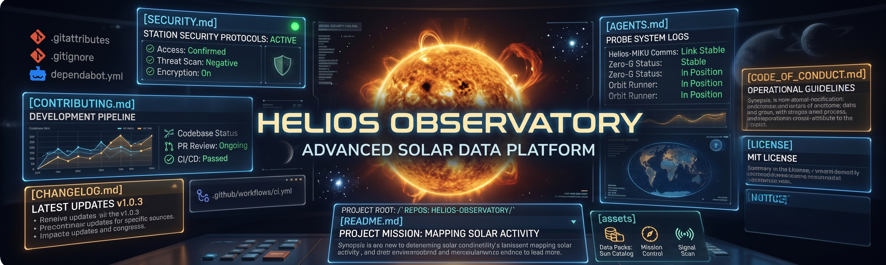
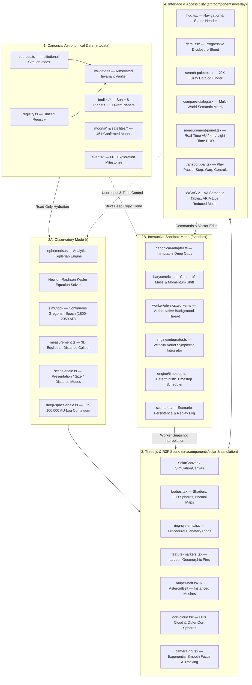

# Helios Observatory

<p align="center">
  
</p>

<p align="center">
  <a href="https://github.com/spearchucker667/Helios-Observatory/actions/workflows/ci.yml"></a>
  <a href="./LICENSE"></a>
  <a href="https://www.typescriptlang.org/"></a>
  <a href="https://eslint.org/"></a>
  <a href="./docs/TESTING.md"></a>
  <a href="https://nodejs.org/"></a>
  <a href="./docs/EPHEMERIS_ENGINE.md"></a>
  <a href="./docs/SATELLITE_CATALOGUE.md"></a>
  <a href="./docs/PHYSICS_ENGINE.md"></a>
  <a href="./SECURITY.md"></a>
</p>

**Helios Observatory** is an open-source, scientifically rigorous 3D astronomical visualization platform and interactive N-body astrophysical sandbox for the Solar System. 

Operating under a dual-mode architectural contract, Helios delivers both an **Observatory Mode** (`/`)—combining analytical Keplerian ephemerides, institutional NASA/JPL data registries, an exhaustive 461-moon natural satellite catalogue, geomorphic surface markers, real-time distance calipers, and a continuous logarithmic deep-space continuum—and an **Interactive Sandbox Mode** (`/sandbox`) powered by an isolated Newtonian N-body engine with a second-order Velocity Verlet (Leapfrog) symplectic integrator, strict SI dimensional units, barycentric momentum conservation, and deterministic scenario persistence.

> **Disclaimer:** Helios Observatory is an independent open-source project. Scientific telemetry is referenced to NASA, JPL, and IAU open-access data. Space-agency styling and Miku-inspired visual elements do not imply affiliation with or endorsement by NASA, Crypton Future Media, or Piapro.

---

## System Architecture

Helios strictly separates **canonical astronomical science**, **numerical physics simulation**, and **visual presentation** so that rendering approximations can never masquerade as observational data.



---

## Key Capabilities

### 1. Analytical J2000 Ephemeris & Epoch Date Control
- **True Keplerian Elliptical Orbits:** Planetary trajectories are derived from J2000 secular orbital elements ($a, e, i, L, \varpi, \Omega$) rather than simplified concentric circles.
- **Newton-Raphson Equation Solver:** Solves Kepler's transcendental equation $M = E - e \sin E$ to a machine tolerance of $\Delta E < 10^{-7}$.
- **Continuous Temporal Interval (1800–2050 AD):** Dial in any historical or future Gregorian calendar date (e.g., Apollo 11 moon landing in 1969, Voyager 2 Neptune flyby in 1989, or contemporary real-time observations).
- **Physical Telemetry Vectors:** Computes true heliocentric Cartesian state vectors $[x_h, y_h, z_h]$ in Astronomical Units ($\text{AU}$) and SI meters ($\text{m}$), accompanied by rigorous scalar distances.

### 2. Comprehensive 461-Moon Natural Satellite Catalogue
- **Institutional Census (August 2026 IAU MPC & NASA/JPL Baseline):** Encompasses all 456 planetary moons across all eight planets plus all 5 satellites of Pluto.
- **Fidelity Tiers:**
  - **Tier 1 (Major Moons — 21 bodies):** Fully textured 3D globes with tidal locking, surface feature markers, and real-time motion tracking (Moon, Phobos, Deimos, Io, Europa, Ganymede, Callisto, Titan, Enceladus, Triton, Charon, etc.).
  - **Tier 2 (Regular Satellites — 38 bodies):** Catalogued with complete orbital elements, orbital semi-major axes, periods, inclinations, and dynamical families.
  - **Tier 3 (Irregular Satellites — 402 bodies):** Captured planetesimals organized into dynamical clusters (Inuit, Norse, Gallic, Pasiphae, Ananke, Himalia, Carme).
- **Natural Satellite Explorer:** Filterable, searchable catalog integrated directly into the planetary detail sheet.

### 3. Interactive Astrophysical Sandbox (`/sandbox`) & Symplectic Engine
- **Velocity Verlet (Leapfrog) Integrator:** Second-order symplectic numerical integration ensures bounded energy oscillation and preserves phase-space volume (Liouville's theorem), preventing artificial orbital decay over long-duration simulations.
- **Strict SI Units:** Operates internally in SI units (meters, meters per second, kilograms, seconds, kelvins, watts), converting to astronomical units purely in the presentation layer.
- **Center-of-Mass & Barycentric Momentum Conservation:** Initial ephemeris states are automatically shifted to the system center of mass with net momentum zeroed ($\sum m_i \mathbf{v}_i = \mathbf{0}$).
- **Tracer Body Modeling:** Objects with negligible mass move according to external gravitational fields without exerting gravitational forces on massive primary bodies.
- **Deterministic Timestep Scheduler:** Simulation time acceleration is completely decoupled from the integration timestep $\Delta t$, avoiding numerical instability during high time-warp rates.
- **Dedicated Web Worker Pipeline:** Simulation updates run on an isolated worker thread, maintaining 60 FPS user-interface and camera transitions on the main thread.
- **Scenario Persistence & Deterministic Replay:** Save and load customized scenario snapshots in versioned JSON structures.

### 4. Interactive Scientific Distance Caliper
- **3D Laser Caliper:** Connect any two celestial bodies in 3D space with an interactive geometric caliper line.
- **Real-Time Telemetry:** Computes Euclidean distance in Astronomical Units ($\text{AU}$), kilometers ($\text{km}$, $1\text{ AU} = 149,597,870.7\text{ km}$), and vacuum light travel time ($c = 299,792.458\text{ km/s}$).
- **Midpoint HUD & Caliper Panel:** Keyboard navigable (`D` / `Escape`) with endpoint swapping and origin-target selection.

### 5. Deep-Space Continuum & Oort Cloud Layer
- **Continuous Logarithmic Spatial Scale:** Smoothly maps distances from the planetary boundary (30 AU) through the Kuiper Belt (30–55 AU), the inner Hills Cloud (2,000–20,000 AU), to the outer isotropic spherical Oort Cloud (~100,000 AU) into WebGL camera space without clipping or $Z$-fighting.
- **Scientific Honesty Disclaimer:** Emphasizes the Oort Cloud as an inferred dynamical comet reservoir rather than a directly imaged surface.

### 6. Surface Inspection & 3D Feature Markers
- **Interactive Globe Markers:** Geomorphic formations (volcanoes, canyons, impact basins, atmospheric storms) display 3D marker pins positioned at exact latitude/longitude coordinates on rotating planetary globes.
- **Stratified Structural Breakdown:** Core/mantle/crust composition layers, global magnetic field summaries, and atmospheric gas volume fractions with barometric surface pressures.

### 7. Dwarf Planet Classification
- Includes **Ceres** (largest body in the asteroid belt) and **Pluto** (with major moon Charon and Nix, Hydra, Kerberos, Styx) modeled using the first-class `dwarf-planet` body architecture.

### 8. Shareable Deep Links
- URLs seamlessly preserve focused worlds, major moons, and the exact simulation epoch date (e.g., `/?body=jupiter&moon=europa&date=2026-09-16`), restoring exact camera framing and simulation state on load.

---

## Celestial Body Matrix

| Class | Celestial Bodies | Confirmed Satellites | Notable Features & Rings |
| :--- | :--- | :--- | :--- |
| **Star** | Sun | — | Granulation shader, core corona glow, solar flares |
| **Terrestrial Planets** | Mercury, Venus, Earth, Mars | Earth (1), Mars (2) | Caloris Basin, Maxwell Montes, Olympus Mons, Valles Marineris |
| **Gas Giants** | Jupiter, Saturn | Jupiter (115), Saturn (293) | Great Red Spot, Galilean moons, prominent rings, Cassini Division, Encke Gap |
| **Ice Giants** | Uranus, Neptune | Uranus (29), Neptune (16) | Tilted retrograde spin, Miranda cliffs, Great Dark Spot, Triton plumes |
| **Dwarf Planets** | Ceres, Pluto | Pluto (5) | Occator crater bright spots, Sputnik Planitia, Tombaugh Regio, Charon |
| **Minor Belts** | Asteroid Belt, Kuiper Belt | — | Procedural instanced asteroids, trans-Neptunian objects |
| **Comet Reservoirs** | Oort Cloud (Hills + Outer Shell) | — | 2,000 to 100,000 AU logarithmic continuum |

---

## Quickstart

### Prerequisites
- Node.js **22.x LTS**
- Modern browser with WebGL 2.0 support

### Running Locally

```bash
# Clone repository
git clone https://github.com/spearchucker667/Helios-Observatory.git
cd Helios-Observatory

# Install dependencies
npm install

# Start development server (bound to 0.0.0.0:8080)
npm run dev

# Run automated test suites (154 passing tests across 22 suites)
npm test

# Run strict zero-warning linter and TypeScript strict check
npm run lint
npm run typecheck

# Verify documentation consistency & vector asset manifests
node scripts/check-doc-consistency.mjs
node scripts/validate-assets.mjs

# Build production distribution and run preview QA
npm run build
npm run preview:restart
```

---

## Controls Summary

### Observatory Mode Shortcuts (`/`)

| Shortcut | Action | Description |
| :--- | :--- | :--- |
| `Space` | Pause / Resume | Freezes or unfreezes simulation clock and ephemeris progression. |
| `0` … `8` | Focus Body | Focus Sun (`0`), Mercury (`1`) through Neptune (`8`). |
| `D` | Distance Caliper | Opens the scientific 3D distance measurement laser caliper. |
| `T` | Epoch Date Control | Opens the J2000 calendar date picker and ephemeris stepper. |
| `C` | Compare Worlds | Opens the multi-body comparison matrix (up to 4 worlds). |
| `⌘K` / `Ctrl+K` | Search Palette | Opens global fuzzy search across bodies, features, satellites, and events. |
| `R` | Reset View | Returns camera to the system-wide barycentric perspective. |
| `Backspace` | Return to Parent | Traverses up the hierarchy (moon → planet → solar system). |
| `L` / `O` / `M` | Display Toggles | Toggle Labels (`L`), Orbital trails (`O`), Moon visibility mode (`M`). |
| `[` / `]` | Simulation Pace | Halves (`[`) or doubles (`]`) simulation speed ($0.25\times$ to $16\times$). |
| `Escape` | Dismiss / Deselect | Closes active dialogs, then clears focused celestial world. |

### Sandbox Mode Shortcuts (`/sandbox`)

| Shortcut | Action | Description |
| :--- | :--- | :--- |
| `Space` | Pause / Resume | Pauses or resumes the authoritative background physics worker. |
| `.` | Single Step | Advances the physics simulation by exactly one numerical timestep $\Delta t$. |
| `[` / `]` | Time Warp Factor | Adjusts time multiplier without altering integration $\Delta t$. |
| `I` | Object Inspector | Toggles state-vector and orbital-elements inspector for selected body. |
| `E` | Edit Velocity | Enables 3D impulse vector manipulators on the focused object. |
| `S` | Save Scenario | Prompts to export the current simulation state as a versioned JSON scenario. |

See [docs/CONTROLS.md](./docs/CONTROLS.md) for full mouse gestures, touch interactions, and accessibility mappings.

---

## Documentation Directory

The complete technical, mathematical, and astronomical documentation suite is maintained under [`docs/`](./docs/):

| Document | Description |
| :--- | :--- |
| [docs/INSTALLATION.md](./docs/INSTALLATION.md) | Comprehensive installation, hardware requirements, and environment setup. |
| [docs/USER_GUIDE.md](./docs/USER_GUIDE.md) | User manual for 3D exploration, calipers, satellite browsing, and sandbox mode. |
| [docs/CONTROLS.md](./docs/CONTROLS.md) | Complete pointer, touch, and keyboard shortcut reference for both modes. |
| [docs/ARCHITECTURE.md](./docs/ARCHITECTURE.md) | System design, 3D scene graph, state stores, and rendering pipeline. |
| [docs/PHYSICS_ENGINE.md](./docs/PHYSICS_ENGINE.md) | Symplectic Velocity Verlet integration, gravitational equations, SI units, and test verifications. |
| [docs/SIMULATION_SANDBOX.md](./docs/SIMULATION_SANDBOX.md) | Interactive sandbox architecture, worker boundaries, provenance, and scenarios. |
| [docs/EPHEMERIS_ENGINE.md](./docs/EPHEMERIS_ENGINE.md) | Keplerian celestial mechanics, Newton-Raphson solver, and J2000 orbital elements. |
| [docs/SATELLITE_CATALOGUE.md](./docs/SATELLITE_CATALOGUE.md) | 461-moon catalogue architecture, MPC/JPL baselines, and fidelity tiers. |
| [docs/MEASUREMENT_SYSTEM.md](./docs/MEASUREMENT_SYSTEM.md) | 3D Euclidean distance calculations in AU, km, and light travel time. |
| [docs/DEEP_SPACE_SCALE.md](./docs/DEEP_SPACE_SCALE.md) | Continuous piecewise logarithmic scaling and Oort Cloud dynamical model. |
| [docs/ASTRONOMICAL_DATA.md](./docs/ASTRONOMICAL_DATA.md) | Canonical data sources, institutional references, and scientific honesty policy. |
| [docs/ASSET_PIPELINE.md](./docs/ASSET_PIPELINE.md) | Scalable vector SVG assets, manifest schema, and texture management. |
| [docs/ASSET_ATTRIBUTION.md](./docs/ASSET_ATTRIBUTION.md) | Attribution for planetary textures, spacecraft imagery, and vector assets. |
| [docs/ACCESSIBILITY.md](./docs/ACCESSIBILITY.md) | WCAG 2.1 AA compliance, keyboard focus trapping, ARIA roles, and contrast. |
| [docs/PERFORMANCE.md](./docs/PERFORMANCE.md) | 60 FPS budget, GPU draw calls, LOD distance thresholds, and memory disposal. |
| [docs/TESTING.md](./docs/TESTING.md) | Automated test runner (154 tests), integrity assertions, and smoke verification. |
| [docs/TROUBLESHOOTING.md](./docs/TROUBLESHOOTING.md) | WebGL context loss, port binding, and headless container troubleshooting. |
| [docs/RELEASE_PROCESS.md](./docs/RELEASE_PROCESS.md) | Quality gates checklist, semantic versioning, and release workflow. |
| [docs/LEGAL.md](./docs/LEGAL.md) | Apache-2.0 licensing, patent grants, trademark policy, and export compliance. |
| [docs/THIRD_PARTY_NOTICES.md](./docs/THIRD_PARTY_NOTICES.md) | Third-party software dependencies and open data citations. |
| [docs/ROADMAP.md](./docs/ROADMAP.md) | Engineering milestones, sandbox roadmap, and astronomical feature backlog. |
| [docs/SCREENSHOTS.md](./docs/SCREENSHOTS.md) | High-resolution visual gallery and responsive viewport captures. |
| [docs/SECURITY_POLICY.md](./docs/SECURITY_POLICY.md) | Security vulnerability reporting and client-side threat model. |
| [docs/DEVELOPMENT.md](./docs/DEVELOPMENT.md) | Developer guide, code style conventions, and startup script contracts. |

---

## License

Helios Observatory is open-source software licensed under the **Apache License, Version 2.0**.  
See the [LICENSE](./LICENSE) and [NOTICE](./NOTICE) files for details.
