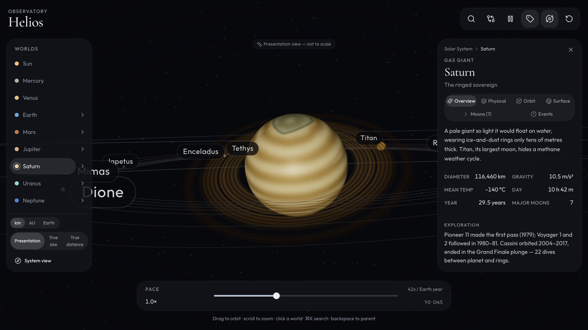
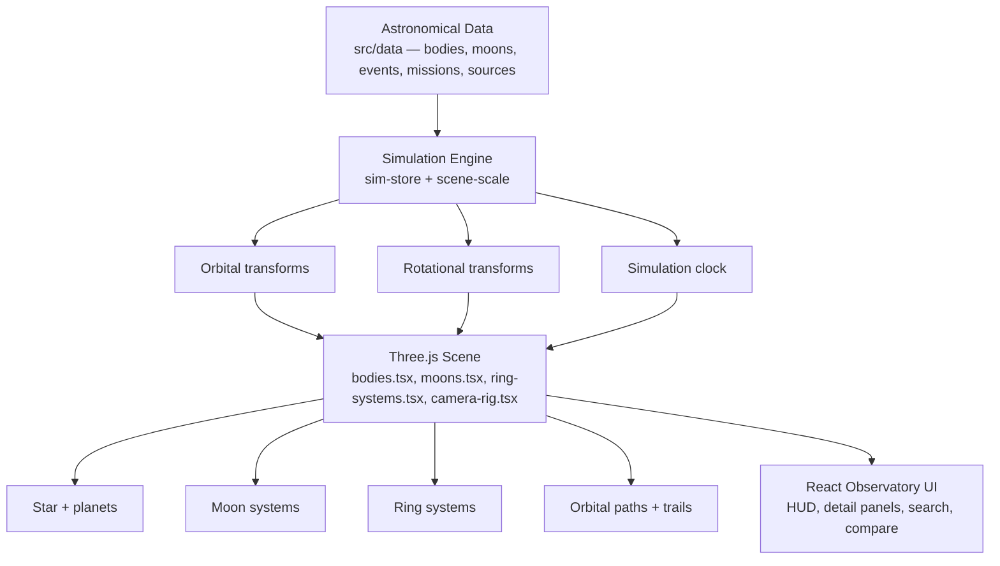

# Helios Observatory

A living orrery of the solar system — an interactive astronomical reference
combining scientific data, high-quality 3D visualisation, planetary and lunar
exploration, and a historical observation archive.



## Purpose

Helios answers two questions at once: **what is out there**, and **how do we
know**. Every world is rendered as an explorable 3D body with canonical
physical data drawn from NASA/JPL fact sheets, and every notable discovery,
mission milestone, and observation is presented as a dated, source-cited
timeline entry.

## Feature summary

- **Solar system** — the Sun, all eight planets, orbit trails, motion trails,
  and an asteroid belt
- **20 major moons** as first-class selectable bodies (Earth's Moon through
  Triton), with orbits, textures, and full data panels
- **Ring systems** for all four ringed planets — Jupiter, Saturn (prominent,
  with Cassini Division and Encke Gap), Uranus, and Neptune
- **Progressive-disclosure detail views** — Overview / Physical / Orbit /
  Surface / Moons / Events tabs per body
- **Historical timeline** — 60+ sourced events from Galileo's 1610 moons to
  the 2021 Parker Solar Probe corona pass
- **Search palette** (⌘K) across bodies, surface features, and events
- **Comparison mode** — up to four worlds side by side
- **Unit systems** — km / AU / Earth-relative
- **Scale modes** — Presentation (default), True size, True distance, with an
  always-visible honesty label
- **Accessibility** — full keyboard operation, ARIA semantics,
  reduced-motion support, DOM equivalents for every selectable body
- **Mobile** — dedicated bottom-sheet layout for narrow viewports

## Solar-system coverage

| Class | Bodies |
| --- | --- |
| Star | Sun |
| Planets | Mercury, Venus, Earth, Mars, Jupiter, Saturn, Uranus, Neptune |
| Moons (Tier 1) | Moon, Phobos, Deimos, Io, Europa, Ganymede, Callisto, Titan, Enceladus, Rhea, Iapetus, Dione, Tethys, Mimas, Titania, Oberon, Ariel, Umbriel, Miranda, Triton |
| Rings | Jupiter, Saturn, Uranus, Neptune |
| Minor bodies | Asteroid belt (procedural instanced mesh) |

Tier-3 irregular satellites (95 confirmed at Jupiter, 146 at Saturn, …) are
represented by catalogue counts and notes rather than rendered meshes — see
`docs/ASTRONOMICAL_DATA.md` for the tier policy.

## Observatory features

- Click any world (or moon) to approach; the camera tracks it in orbit
- Breadcrumb navigation: `Solar System > Saturn > Titan`, with Backspace to
  return to the parent
- Moon-system modes: auto (revealed on approach), always, hidden
- Events tab per body: dated, sourced, chronological milestones
- Surface features with planetographic coordinates where defensible
  (approximate locations are labelled as approximate)
- Comparison dialog for 2–4 bodies across nine metrics

## Controls

| Input | Action |
| --- | --- |
| Drag / scroll | Orbit / zoom the camera |
| Click a world | Select and approach |
| `Space` | Pause / resume |
| `0`–`8` | Select Sun … Neptune |
| `←`/`→` arrows, list, or search | Navigate bodies |
| `Backspace` | Return to parent (moon → planet → system) |
| `R` | Reset system view |
| `L` / `O` | Toggle labels / orbits |
| `M` | Cycle moon mode (auto → always → hidden) |
| `C` | Compare worlds |
| `⌘K` / `Ctrl-K` | Search palette |
| `Esc` | Close dialogs / deselect |

Full reference: [docs/CONTROLS.md](docs/CONTROLS.md)

## Installation

```bash
npm install
```

Requires Node 22+. No database or auth is needed for local development —
Helios is fully client-side.

## Development commands

```bash
npm run dev         # dev server (0.0.0.0:8080)
npm run typecheck   # tsc --noEmit
npm run lint        # eslint
npm test            # node:test suites (data integrity, formatting, platform)
npm run build       # production build
npm run preview:restart  # serve the built output on :8081
```

## Build instructions

`npm run build` produces the deployable bundle (Vercel output). The
production build is verified with the same browser smoke test as dev:

```bash
npm run preview:restart
node scripts/browser-smoke.mjs
```

## Architecture overview



Details: [docs/ARCHITECTURE.md](docs/ARCHITECTURE.md)

## Astronomical-data policy

Canonical figures come from NASA/JPL fact sheets and mission pages; every
dataset entry cites its source ids and a retrieval date. Historical events
are never invented — each entry lists the missions/observers and sources
behind it. Where the visualisation departs from physical scale (it does), the
UI says so on screen.

- Data contracts: `src/data/types.ts`
- Source registry: `src/data/sources.ts`
- Integrity tests: `src/data/data-validate.test.ts`
- Policy doc: [docs/ASTRONOMICAL_DATA.md](docs/ASTRONOMICAL_DATA.md)

## Asset attribution policy

All planetary and lunar surfaces are **procedurally generated** at runtime
(canvas-based noise and structural painting) — no third-party raster assets
are shipped, so no attribution obligations attach to imagery. Brand/UI
vector assets live in `public/assets/` and are original works. See
[docs/ASSET_PIPELINE.md](docs/ASSET_PIPELINE.md) and
[docs/ASSET_ATTRIBUTION.md](docs/ASSET_ATTRIBUTION.md).

## Browser / platform support

- **Desktop** — Chrome/Edge 111+, Firefox 113+, Safari 16.4+ (WebGL 2,
  `backdrop-filter`, CSS nesting via Tailwind v4)
- **Mobile** — iOS Safari 16.4+, Chrome for Android (dedicated bottom-sheet
  layout, touch targets ≥ 44 px)
- Keyboard-only and screen-reader operation supported (see
  [docs/ACCESSIBILITY.md](docs/ACCESSIBILITY.md))

## Accessibility statement

The 3-D canvas alone is not accessible, so every selectable body has a DOM
equivalent (sidebar list, search palette, comparison dialog). The interface
provides: logical focus order, visible focus indicators, ARIA roles and
labels, `prefers-reduced-motion` support (transitions snap instead of glide),
and no colour-only information. Details:
[docs/ACCESSIBILITY.md](docs/ACCESSIBILITY.md).

## Performance notes

- Two-tier procedural textures: LOW at system range, HIGH (2048×1024,
  body-specific structure) generated lazily on approach and cached
- Shared geometry, instanced asteroid belt, DPR capped at 1.75
- Moon systems render only when their parent is focused or `always` mode
- Canvas bundle is code-split and lazy-loaded
- Details and budgets: [docs/PERFORMANCE.md](docs/PERFORMANCE.md)

## Project structure

```
src/
├── components/
│   ├── overlay/          # HUD, detail panel, search, compare
│   └── solar/            # Three.js scene: bodies, moons, rings, camera, textures
├── data/                 # Canonical astronomy (bodies, moons, events, missions, sources)
├── lib/                  # Formatting, scale mapping, sim store
└── routes/               # TanStack Start routes
public/assets/            # SVG brand assets
docs/                     # Architecture, data policy, pipeline, guides
scripts/                  # Build/QA tooling (smoke test, preview server)
```

## Contributing

See [CONTRIBUTING.md](CONTRIBUTING.md). Astronomical-data corrections are
especially welcome — use the
[data-correction issue template](.github/ISSUE_TEMPLATE/data-correction.md)
and cite sources.

## Roadmap

See [docs/ROADMAP.md](docs/ROADMAP.md) — next up: dwarf planets (Ceres,
Pluto), guided tours, shareable deep links.

## Known limitations

- **Positions are educational approximations.** Orbits are circular with
  correct periods and inclinations — not epoch ephemerides. The UI never
  claims otherwise.
- **Sizes/distances are compressed by design** in the default Presentation
  mode; True size / True distance modes exist for honest ratios, and the
  active mode is always labelled on screen.
- Temporary storms (e.g. Neptune's Great Dark Spot) are rendered as
  historical features, not permanent geography.
- Tier-3 moons are catalogued, not rendered.
- No real-time sky positions, eclipses, or transit predictions.

## License

Not yet established — see [SECURITY.md](SECURITY.md) for reporting and
[CONTRIBUTING.md](CONTRIBUTING.md) for the current licensing discussion.
