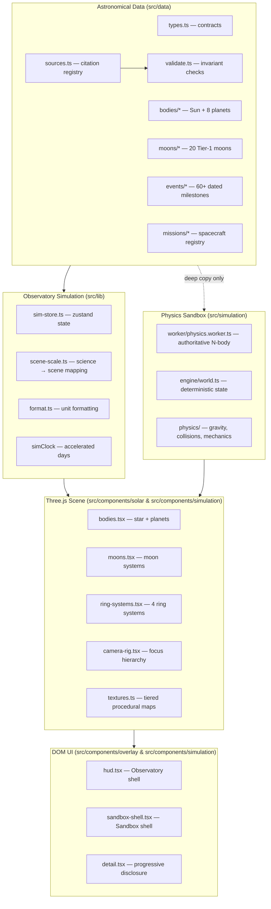

# Architecture

Helios separates **science**, **simulation**, and **presentation** into
independent layers so that presentation compromises can never masquerade as
astronomical data.



## Modes

- **Observatory Mode (`/`)**: Source-backed reference with analytical ephemeris.
- **Sandbox Mode (`/sandbox`)**: Mutable numerical experiment using an isolated Newtonian physics engine.

## Layers

### 1. Astronomical data (`src/data/**`)

Pure TypeScript records, no rendering knowledge. The central contract is
`CelestialBody` / `MoonBody` in `src/data/types.ts`:

- `identity` — id, kind (`star | planet | dwarf-planet | moon`), parent id,
  colour, discovery
- `physical` — radius, mass, gravity, escape velocity, density
- `orbit` — semi-major axis (AU or km), period, eccentricity, inclination
- `rotation` — sidereal day (negative = retrograde), axial tilt
- `temperature`, `atmosphere`, `interior`, `magneticField`, `rings`,
  `moonSystem`, `features[]`
- `sources[]` + `retrieved` — every entry cites the registry

`src/data/validate.ts` enforces cross-record invariants at test time (unique
ids, resolvable parents, positive quantities, citations that exist). The
integrity suite lives in `src/data/data-validate.test.ts`.

### 2. Simulation (`src/lib`)

- **`sim-store.ts`** — zustand store: selection, pause/speed, moon mode,
  units, scale mode, plus the mutable `simClock` (elapsed sim days).
- **`scene-scale.ts`** — the *only* place science numbers become scene
  numbers. Three modes: `presentation` (log-compressed), `relative-size`
  (true radii), `distance` (true orbital spacing). Moon orbits/radii use
  log compression relative to the parent's scene radius.
- **`format.ts`** — unit formatting (km/AU/Earth-relative), the single place
  display strings are produced.

### 3. Scene (`src/components/solar`)

- **`bodies.tsx`** — star (custom shader), generic `Planet` component driven
  entirely by data records; LOD tier switch (LOW/HIGH textures) at ~12 planet
  radii camera distance; asteroid belt as one instanced mesh.
- **`moons.tsx`** — `MoonSystem` renders a parent's Tier-1 moons with orbits,
  tidal locking, picking, and labels. Visibility: `auto | always | hidden`.
- **`ring-systems.tsx`** — one radial-profile ring generator parameterised by
  the data layer's `RingSystem` (inner/outer radii, divisions). Saturn's
  prominence is data-driven, not special-cased geometry.
- **`camera-rig.tsx`** — exponential-glide focus with exact tracking for
  fast-moving moons; parent/system navigation; reduced-motion snap.
- **`textures.ts`** — tiered procedural texture cache (see
  [ASSET_PIPELINE.md](ASSET_PIPELINE.md)).

### 4. Observatory UI (`src/components/overlay`)

- **`hud.tsx`** — header controls, world list with moon expanders, settings
  (units/scale), pace footer, scale-honesty label, mobile bottom sheet.
- **`detail.tsx`** — tabbed progressive disclosure per body: Overview,
  Physical, Orbit, Surface, Moons, Events (with source citations).
- Search (⌘K, cmdk) across bodies, features, events; compare dialog for
  2–4 bodies.

### 5. Physics Sandbox (`src/simulation`)

- **`initialization/canonical-adapter.ts`** — strictly clones canonical registry
  records into mutable simulation bodies, computing SI state vectors and tagging
  unmeasured mass bodies as tracers.
- **`initialization/barycentric.ts`** — shifts state vectors into the center of
  mass frame, zeroing net system momentum ($\sum m_i \mathbf{v}_i = \mathbf{0}$).
- **`engine/integrator.ts`** — second-order Velocity Verlet symplectic
  integrator preserving phase-space volume and mechanical energy.
- **`engine/timestep.ts`** — deterministic timestep scheduler decoupling time
  acceleration from integration $\Delta t$.
- **`worker/physics.worker.ts`** — authoritative background worker executing
  the N-body loop and streaming state snapshots to the main thread.
- **`scenarios/`** — versioned JSON scenario serialization, schema migrations,
  IndexedDB persistence, and deterministic replay logs.

## Selection hierarchy

```
Sun
└── Planet (parentId: "sun")
    └── Moon (parentId: planet id)
```

Selection is a flat string id (`useSim.select`); the hierarchy is derived
from `parentId`. Breadcrumbs and Backspace walk it upward; the camera and
scene resolve any id through the single registry (`src/data/registry.ts`).

## Adding a body

1. Create `src/data/bodies/<id>.ts` (or `src/data/moons/<id>.ts`) exporting
   a `CelestialBody`/`MoonBody` with sources.
2. Register it in `src/data/registry.ts` (bodies) or `src/data/moons/index.ts`.
3. Optional: add a LOW texture factory in `textures.ts` (`LOW_FACTORIES`) —
   a generic cratered fallback exists otherwise.
4. Run `npm test` — the integrity suite verifies parents, uniqueness, and
   citations.
