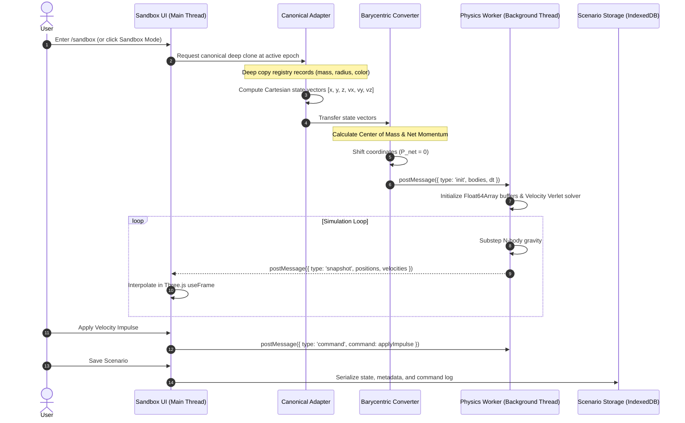

# Interactive Astrophysical Sandbox Architecture & Guide

This document defines the architectural contract, user workflows, data isolation principles, and worker communication protocols for Helios Observatory's **Interactive Sandbox Mode** (`/sandbox`).

---

## 1. Architectural Contract: Two Worlds

Helios Observatory operates under a strict dual-mode model:

| Dimension | Observatory Mode (`/`) | Sandbox Mode (`/sandbox`) |
| :--- | :--- | :--- |
| **Purpose** | Institutional astronomical reference and 3D orrery. | Experimental N-body numerical laboratory and scenario sandbox. |
| **Ephemeris Engine** | Analytical Keplerian orbital elements (Standish / JPL DE405). | Numerical symplectic N-body integration (Velocity Verlet). |
| **State Mutability** | Strictly immutable. Positions derive directly from epoch time. | Fully mutable. Objects can be injected, shifted, boosted, or deleted. |
| **State Origin** | Direct citations from NASA, JPL, IAU, and USGS. | Initialized as an isolated deep copy; evolves dynamically. |
| **Execution Context** | Main thread synchronously on animation frame (`simClock`). | Authoritative background Web Worker (`physics.worker.ts`). |
| **Data Integrity** | Governed by `src/data/validate.ts`. | Governed by conservation laws in `src/simulation/tests/`. |

---

## 2. Canonical Isolation & Adapter Pipeline

The fundamental invariant of the sandbox is: **no sandbox operation may ever mutate canonical reference data (`src/data/**`)**.



### 2.1 State Vector Conversion
When transitioning from the canonical registry into the simulation, `src/simulation/initialization/canonical-adapter.ts`:
1. Converts mean orbital radius and semi-major axis into SI meters.
2. Derives velocities from the analytical Keplerian solver in meters per second ($\text{m/s}$).
3. Maps planetary and lunar masses into kilograms ($\text{kg}$).
4. Marks missing masses (such as minor irregular satellites without mass estimates) as **Tracer Particles**, preventing unphysical gravitational perturbations.

### 2.2 Barycentric Frame Transformation
To prevent the solar system from drifting across the coordinate grid, `src/simulation/initialization/barycentric.ts` computes the system center of mass $\mathbf{R}_{\text{cm}}$ and center-of-mass velocity $\mathbf{V}_{\text{cm}}$, subtracting them from all initial state vectors so that total initial linear momentum is zero.

---

## 3. Worker Boundary & Messaging Protocol

All compute-intensive N-body calculations execute in a dedicated background worker (`src/simulation/worker/physics.worker.ts`), keeping the browser UI fluid and responsive at 60 FPS.

### 3.1 Main Thread to Worker Messages (`WorkerMessage`)

Defined in `src/simulation/worker/protocol.ts`:

```typescript
export type WorkerMessage =
  | { type: "init"; dt: number; bodies: SimulationBody[] }
  | { type: "command"; command: SimulationCommand }
  | { type: "snapshotReq" }
  | { type: "setTimestep"; dt: number }
  | { type: "setTimeMultiplier"; multiplier: number }
  | { type: "pause" }
  | { type: "resume" }
  | { type: "stepOnce" }
  | { type: "reset" };
```

### 3.2 Worker to Main Thread Messages (`MainMessage`)

```typescript
export type MainMessage =
  | { type: "snapshot"; data: SimulationSnapshot }
  | { type: "event"; event: SimulationEvent }
  | { type: "error"; error: string };
```

- **Snapshots:** Fixed-frequency state vectors containing flat typed arrays (`Float64Array`) of 3D positions and velocities.
- **Events:** Asynchronous discrete events triggered during physics substepping (e.g. physical collisions, tidal disruptions, black hole event-horizon captures).

---

## 4. Provenance Taxonomy

Every parameter displayed in the Sandbox Mode UI carries explicit scientific provenance (`src/simulation/domain/provenance.ts`):

- **Canonical (`canonical`):** Measured observational data from institutional references (NASA/JPL/IAU).
- **Calculated (`calculated`):** Direct mathematical outcome of numerical N-body integration under modeled physics.
- **Estimated (`estimated`):** Model-dependent approximations (e.g., Roche limits, equilibrium temperatures, mean density estimates).
- **Custom (`custom`):** Values injected or modified directly by the user (no observational claim).
- **Unsupported (`unsupported`):** Quantities outside the engine's physical scope (e.g. general relativistic precession, magnetic drag).

---

## 5. User Workflows & Controls

### 5.1 Object Inspector & Vector Manipulator
- **Selection:** Click any celestial body in the 3D viewport or select from the Object Browser to inspect its instantaneous Cartesian state vector $[x, y, z, v_x, v_y, v_z]$ and osculating Keplerian orbital elements ($a, e, i$).
- **Impulse Application:** Enter velocity adjustments ($\Delta \mathbf{v}$) in $\text{km/s}$ along prograde, retrograde, normal, or radial vectors.
- **Mass & Radius Editing:** Tweak body mass ($M_\oplus$, $M_\odot$, or $\text{kg}$) and mean radius. The engine automatically recalculates surface gravity, escape velocity, and Roche disruption boundaries.

### 5.2 Transport Controls
- **Play / Pause (`Space`):** Freezes worker integration while maintaining full camera navigation and 3D globe inspection.
- **Single Step (`.`):** Advances the simulation by exactly one fixed numerical timestep $\Delta t$.
- **Time Warp (`[` / `]`):** Scales the rate of simulation time progression from $1\times$ up to $100,000\times$ without altering the numerical integration step $\Delta t$, ensuring stability.

### 5.3 Adding Celestial Bodies & Spawning Presets
- **Presets (`src/simulation/domain/presets.ts`):** Spawn predefined astrophysical configurations:
  - *Inner Solar System (Sun, Mercury, Venus, Earth, Mars)*
  - *Full Planetary System (Sun + 8 Planets + Pluto)*
  - *Earth-Moon System with L1-L5 Lagrange Test Particles*
  - *Jupiter and Galilean Moons Resonance System*
  - *Binary Star Encounter*
  - *Schwarzschild Black Hole Intrusion*
- **Custom Body Creation:** Configure mass, radius, initial position, and orbital velocity vectors directly before launching into the simulation.

---

## 6. Scenario Persistence & Deterministic Replay

Scenarios can be exported and imported as standardized JSON documents (`src/simulation/scenarios/schema.ts`):

```json
{
  "version": "1.0.0",
  "engineVersion": "1.0.0",
  "integrator": "velocity-verlet",
  "timestepSeconds": 3600,
  "timestamp": 1789728000,
  "bodies": [
    {
      "id": "sun",
      "name": "Sun",
      "massKg": 1.98847e30,
      "radiusMeters": 6.957e8,
      "position": [0, 0, 0],
      "velocity": [0, 0, 0],
      "isTracer": false,
      "color": "#FDB813"
    }
  ],
  "commandLog": []
}
```

- **Deterministic Replay:** Because the Velocity Verlet algorithm and Timestep Scheduler are strictly deterministic and independent of frame rate, replaying a logged command stream from the initial snapshot produces bit-identical trajectories.
- **Local Persistence:** Scenarios are automatically stored locally in IndexedDB (`src/simulation/scenarios/storage.ts`) and can be exported as `.json` files for sharing.

---

## 7. Component Hierarchy

```text
src/components/simulation/
├── simulation-app.tsx        Top-level sandbox orchestrator & state context
├── simulation-canvas.tsx     Three.js WebGL canvas wrapper with resize handlers
├── simulation-scene.tsx      Scene graph with lighting, starfield, and bodies
├── simulation-body.tsx       Instanced rendering of celestial spheres, trails, and labels
├── transport-bar.tsx         Play, pause, step, speed, and reset HUD controls
├── body-inspector.tsx        Tabbed panel for telemetry, orbital elements, and provenance
├── object-browser.tsx        Searchable list of all active bodies and tracers
├── vector-editor.tsx         Velocity vector manipulaton and Cartesian input fields
├── vector-layer.tsx          3D velocity arrow rendering in Three.js
├── trajectory-layer.tsx      Osculating and numerical trajectory line renderers
├── scenario-manager.tsx      Save, load, import, and export modal dialog
├── compact-object-visuals.tsx Accretion disk, event horizon, and relativistic beam shaders
└── accuracy-indicator.tsx    Real-time energy conservation and numerical error HUD badge
```
